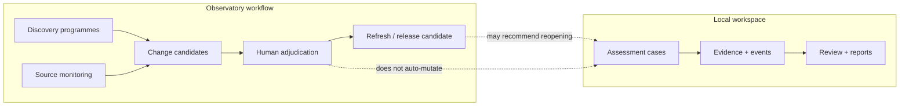

# NeuroAI Workbench

[](https://github.com/fraware/neuroai-workbench/actions/workflows/ci.yml)
[](LICENSE)
[](pyproject.toml)

**Offline-first tooling for exact NeuroAI assessments and controlled observatory evidence records.**

The workbench helps researchers, reviewers, and programme operators keep system boundaries, evidence, findings, and decisions attributable and reproducible—without pretending that software can authorize scientific, clinical, or regulatory conclusions.

> **Boundary**
>
> Schema checks, digests, event chains, and passing tests establish integrity and internal consistency only. They do not establish scientific truth, clinical effectiveness, legal authorization, ethical acceptability, deployment readiness, or system conformance. Those judgments require substantive evidence and a named competent authority.

---

## Who it is for

- Assessors and reviewers working with the **v4.2 Pilot-Calibrated Universal NeuroAI Assessment Instrument**
- Research and governance teams that need local, auditable case workspaces
- Programme operators who maintain controlled source registries, change candidates, and reopening queues
- Contributors building offline-first evidence tooling for neurotechnology and NeuroAI

---

## What you can do

| Area | In plain terms |
| --- | --- |
| **Assess** | Create and validate v4.2 cases against all 78 normative requirement identifiers |
| **Preserve** | Register evidence bytes with SHA-256 identity; verify digests later |
| **Record** | Append hash-chained events; freeze snapshots; export case bundles |
| **Review** | Assign local review roles, record agreement or dissent, apply accepted proposals only through ordinary assessment edits |
| **Exchange** | Prepare metadata-only protected-evidence requests without moving evidence bytes |
| **Assist** | Import and disposition model drafts without calling a provider or auto-mutating findings |
| **Monitor** | Plan source checks, compare captures, and queue human adjudications for observatory refresh |
| **Discover** | Run governed source-universe programmes (including **SU-TRIAL**) that emit candidates, not canonical truth |
| **Report** | Render deterministic Markdown assessment, gap, and review reports |
| **Compare** | Diff assessments across cases without inventing new findings |

Default operation is **local and offline**. Network collection, if used at all, stays outside the core workbench behind an explicitly approved collector.

---

## What it deliberately does not do

- Decide whether a NeuroAI system is safe, effective, lawful, ethical, or conformant
- Replace a regulator, ethics board, institutional authority, or clinical decision-maker
- Treat missing or inaccessible evidence as an automatic substantive failure
- Authenticate people or institutions (local review roles are claimed workflow identities)
- Call external model APIs or rewrite historical findings in place
- Transfer protected evidence bytes through metadata exchange records
- Claim UNESCO endorsement, institutional deployment readiness, or that tests authorize a release

---

## How the pieces relate



Assessments and observatory state stay coupled by explicit dependencies and reopening recommendations—not by silent overwrite.

---

## Install

Requires **Python 3.10+**.

```bash
git clone https://github.com/fraware/neuroai-workbench.git
cd neuroai-workbench

python -m venv .venv
# macOS / Linux
source .venv/bin/activate
# Windows PowerShell
# .venv\Scripts\Activate.ps1

python -m pip install -e ".[dev]"
```

Runtime dependency is `jsonschema` only. The `[dev]` extra adds lint, type-check, test, and optional publication-product tooling.

Entry points after install:

| Command | Role |
| --- | --- |
| `neuroai-workbench` | Assessments, evidence, review, reports, local UI |
| `neuroai-monitor` | Source-registry planning and monitoring workspace ops |
| `neuroai-refresh` | Non-canonical observatory refresh cycle helper |
| `neuroai-portfolio` | Read-only cross-case assessment comparison |
| `neuroai-data` | Data health, search, and evidence crosswalk helpers |

---

## Quick start

All of the following works offline on a trusted machine.

### 1. Create a workspace and open the local UI

```bash
neuroai-workbench init workspaces/demo
neuroai-workbench case-create workspaces/demo CASE-001 \
  --title "Controlled NeuroAI assessment"
neuroai-workbench serve workspaces/demo
```

Open [http://127.0.0.1:8765](http://127.0.0.1:8765).

The reference server binds to localhost by default. It has **no authentication, authorization, multi-tenant isolation, or TLS**. Do not expose it on an untrusted network. Non-loopback binding requires both an explicit flag and `NEUROAI_ALLOW_NETWORK=1`.

### 2. Import a public reference assessment

```bash
neuroai-workbench case-import workspaces/demo \
  examples/assessments/PILOT-02_FDA_Adaptive_DBS_v4.2.json

neuroai-workbench validate \
  --workspace workspaces/demo \
  --case-id PILOT-02-FDA-ADBS-v4.1.4
```

Public fixtures also cover Brain2Qwerty, BrainGate2 T15, and PRIMA under `examples/assessments/`.

### 3. Register and verify evidence

```bash
neuroai-workbench evidence-add workspaces/demo CASE-001 report.pdf \
  --title "Controlled technical report" \
  --type "METHOD OR TECHNICAL DOCUMENT" \
  --source "Local authorized copy"

neuroai-workbench evidence-verify workspaces/demo CASE-001
```

Registration establishes local byte identity and custody. It does not establish authenticity, relevance, methodological adequacy, or decision weight.

### 4. Snapshot and bundle

```bash
neuroai-workbench snapshot workspaces/demo CASE-001 --label evidence-freeze
neuroai-workbench bundle workspaces/demo CASE-001 artifacts/CASE-001.zip
```

### 5. Optional: adapt a programme record

```bash
neuroai-workbench programme-adapt \
  examples/programme/PRIMA_COMPLETED_ASSESSMENT_v4.2.1.programme.json \
  artifacts/PRIMA.native.json \
  --report artifacts/PRIMA.adapter-report.json

neuroai-workbench report \
  --assessment artifacts/PRIMA.native.json \
  --output artifacts/PRIMA.md
```

Adaptation is loss-aware and explicit. It does not invent missing substantive judgments.

### 6. Optional: plan observatory source checks

```bash
neuroai-monitor registry-validate \
  examples/operations/SOURCE_MONITOR_REGISTRY_SAMPLE.json

neuroai-monitor init workspaces/operations \
  examples/operations/SOURCE_MONITOR_REGISTRY_SAMPLE.json

neuroai-monitor plan workspaces/operations \
  --out artifacts/monitor-plan.json
```

Network acquisition remains outside the default workbench. An approved collector captures source bytes; the workbench controls identity, comparison, review, and release preparation.

### 7. Optional: offline discovery reference flow

```bash
python scripts/offline_reference_flow.py --output-dir .tmp/offline-flow
```

This emits fixture-backed candidates, human-gated adjudications, and a **mechanical** release candidate. It does not authorize publication or mutate assessments. Discovery programmes such as **SU-TRIAL** identify candidate sources within a declared universe; they do not claim completeness or assessment effect.

---

## Project layout

```text
neuroai-workbench/
├── src/neuroai_workbench/   # Library, CLIs, local UI, schemas, resources
├── examples/                # Public assessments, programme records, ops samples
├── docs/                    # Architecture, governance, operations, reference
├── tests/                   # Unit, integration, and adversarial coverage
├── scripts/                 # Offline flows and repository hygiene checks
├── schema/                  # Shared schema surfaces
└── verification/            # Release-verification support assets
```

Normative v4.2 machine-readable resources ship inside the package. Treat edits to those resources as a governed change, not an incidental refactor.

---

## Documentation

| Start here | Purpose |
| --- | --- |
| [Documentation map](docs/README.md) | Full index of architecture, ops, and reference docs |
| [Architecture overview](docs/architecture/overview.md) | Component and storage boundaries |
| [Evidence and decision boundary](docs/governance/evidence-boundary.md) | What software can and cannot decide |
| [Observatory automation](docs/operations/observatory-automation.md) | Monitoring operating model |
| [CLI reference](docs/reference/cli.md) | Command surface |
| [Collaborative review](docs/reference/review.md) | Review records and application rules |
| [Protected-evidence exchange](docs/reference/evidence-exchange.md) | Metadata-only custodian workflow |
| [Controlled model assistance](docs/reference/assistance.md) | Provider-neutral assistance records |
| [Threat model](THREAT_MODEL.md) | Security assumptions and withheld claims |
| [Data governance](DATA_GOVERNANCE.md) | Data handling expectations |
| [Release process](docs/operations/release-process.md) | Software release integrity |

Engineering invariants for contributors live in [`AGENTS.md`](AGENTS.md).

---

## Status

| Layer | Current state |
| --- | --- |
| Package on `main` | `0.3.0.dev0` (development identity; not a tagged `v0.3.0` release) |
| Latest published tag | [`v0.2.1`](https://github.com/fraware/neuroai-workbench/releases/tag/v0.2.1) |
| v4.2 requirement semantics | Unchanged; all 78 identifiers preserved |
| Institutional deployment readiness | Not established by this software |

Software-release state, canonical observatory publication, and institutional readiness are independent. Evidence for one must not be treated as evidence for another.

---

## Contributing

See [`CONTRIBUTING.md`](CONTRIBUTING.md) and the [code of conduct](CODE_OF_CONDUCT.md).

```bash
python -m pip install -e ".[dev]"
make quality
make test
```

Add tests for every behavioral change. Do not commit private neural data, participant records, credentials, or generated release artifacts.

---

## Security

Report vulnerabilities through the repository’s private security-advisory channel. See [`SECURITY.md`](SECURITY.md).

Do not file public issues that disclose private neural data, participant records, credentials, unreleased assessment evidence, or exploitable deployment details.

---

## License

Apache License 2.0. See [`LICENSE`](LICENSE) and [`NOTICE`](NOTICE).

Incorporated v4.2 assessment resources retain their controlled provenance. The software does not represent UNESCO endorsement, Secretariat adoption, Member State consensus, legal authorization, clinical advice, certification, or a completed conformance decision.
