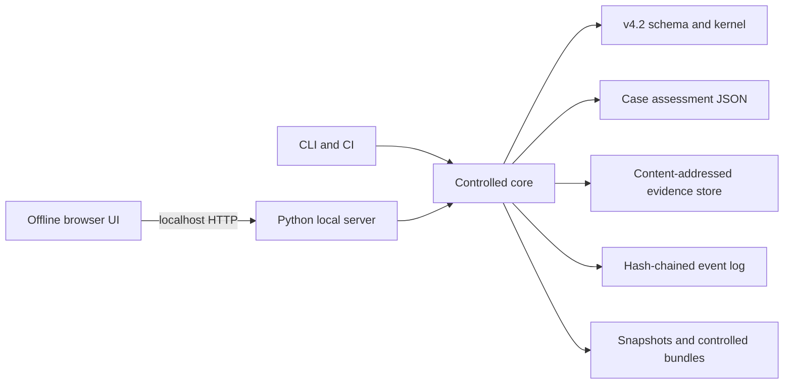

# Architecture

## Design objective

The workbench is a local evidence and decision environment for exact, versioned NeuroAI assessments. Its architecture minimizes runtime dependencies and keeps protected bytes inside a user-controlled workspace.



## Components

- `validation.py` performs JSON Schema Draft 2020-12 and semantic validation.
- `workspace.py` controls case lifecycle and atomic writes.
- `evidence.py` preserves evidence bytes and checks digests.
- `events.py` appends and verifies the event hash chain.
- `migration.py` implements additive v4.1.2 migration.
- `comparison.py` aggregates existing findings without issuing new ones.
- `server.py` exposes the local HTTP API and static application.
- `cli.py` provides reproducible command-line operations.

## Storage model

```text
workspace/
  workspace.json
  cases/
    CASE-ID/
      assessment.json
      events.jsonl
      evidence/
        index.json
        objects/<sha256>.<ext>
      snapshots/<timestamp-label>/
      exports/
  exports/
  tmp/
```

## Decision boundary

The engine reports software validity, evidence-byte integrity, event-chain integrity, mechanical P0 blockers and typed decision records separately. It does not generate an authorization or conformance conclusion from a numerical score.
