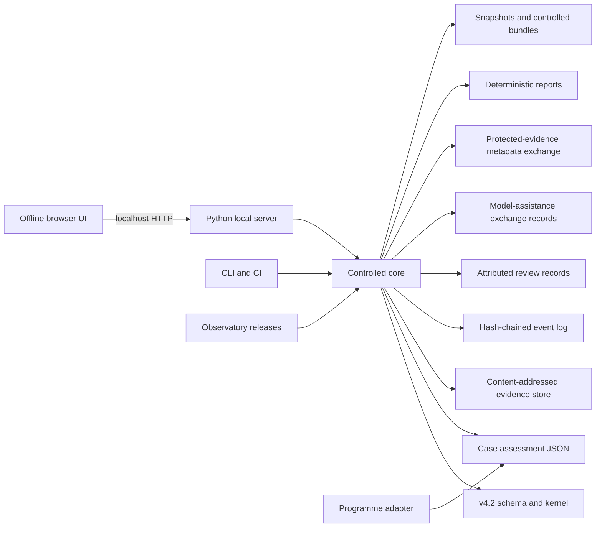

# Architecture

## Design objective

The workbench is a local evidence and decision environment for exact, versioned NeuroAI assessments. Its architecture minimizes runtime dependencies, keeps protected bytes inside a user-controlled workspace, and separates mechanical integrity from substantive judgment.



## Components

- `validation.py` performs JSON Schema Draft 2020-12 and semantic validation.
- `workspace.py` controls case lifecycle and atomic writes.
- `evidence.py` preserves evidence bytes and checks digests.
- `events.py` appends and verifies the event hash chain.
- `migration.py` implements additive v4.1.2 migration.
- `comparison.py` aggregates existing findings without issuing new ones.
- `programme_adapter.py` maps controlled programme assessment records into the native v4.2 object model and emits explicit loss information.
- `observatory.py` validates and imports full baselines and compact successor snapshots without overwriting predecessors.
- `review.py` records claimed local review assignments, statements, disagreements, and human dispositions without mutating assessments or authenticating identities.
- `exchange.py` creates minimum-necessary evidence-custodian requests and records out-of-band holder responses without transferring evidence bytes.
- `assistance.py` records bounded provider-neutral model requests, candidate responses, hashes, and human dispositions without calling a provider or granting decision authority.
- `reports.py` renders deterministic assessment, evidence-gap, and review projections from stored records.
- `server.py` exposes the local HTTP API and static application.
- `cli.py` provides reproducible command-line operations.

## Storage model

```text
workspace/
  workspace.json
  cases/
    CASE-ID/
      assessment.json
      events.jsonl
      evidence/
        index.json
        objects/<sha256>.<ext>
      reviews/
        assignments/*.json
        statements/*.json
        dispositions/*.json
      assistance/
        requests/*.json
        responses/*.json
        dispositions/*.json
      exchanges/
        requests/*.json
        responses/*.json
      snapshots/<timestamp-label>/
      exports/
  observatory/
  exports/
  tmp/
```

Review, assistance, and protected-evidence exchange records are append-oriented sidecar records. A statement, disposition, or model response does not edit `assessment.json`. A later accepted change must pass through an ordinary human-controlled assessment edit with its own provenance.

## Trust boundaries

The local server provides no authentication, authorization, tenant isolation, or institutional identity proof. Reviewer identifiers and roles are workflow claims. Hashes detect changes to recorded bytes; they do not prove identity, source authenticity, scientific validity, or delegated authority.

The default assistance workflow makes no external model call. Any provider integration requires a separate architecture decision covering opt-in, classification, redaction, retention, training use, egress, prompt injection, credentials, cost, and incident handling.

## Decision boundary

The engine reports software validity, evidence-byte integrity, event-chain integrity, review-record integrity, model-exchange integrity, mechanical P0 blockers, and typed decision records separately. It does not generate an authorization or conformance conclusion from a numerical score, a reviewer role, a model response, or a valid hash chain.
